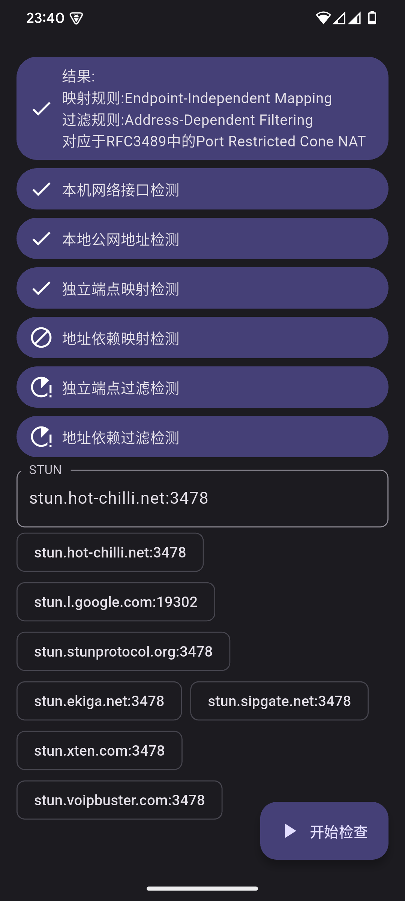

# Purity NAT Type Checker

一款基于 RFC 5780 的 NAT 类型检测工具，帮助开发者和网络管理员快速识别网络环境中的 NAT 类型。该工具专注于简洁、可靠，提供精确的检测结果，助力网络配置和性能优化。

---

## ✨ 功能

- 🌐 提供 NAT 类型检测功能。
- 🎨 简洁美观的用户界面，易于操作。
- 🛑 完全离线，不依赖互联网连接。
- 🚫 无非必要的权限请求，尊重用户隐私。
- 📱 支持多平台（Windows、Mac、Linux、Android、iOS、Web）。

---

## 不支持Web平台

由于浏览器在通过 WebSockets 使用 UDP 时存在限制，此应用程序不支持网页平台。欲了解更多信息，请参阅以下链接：

- [Why can't I send UDP packets from a browser?](https://gafferongames.com/post/why_cant_i_send_udp_packets_from_a_browser/)
- [JavaScript WebSockets with UDP?](https://stackoverflow.com/questions/4657033/javascript-websockets-with-udp)
- [Reading from UDP port in browser](https://www.codeease.net/programming/questions/reading-from-udp-port-in-browser)

---

## 📸 截图

   
   
   

---

## 📥 安装

1. 从 [releases 页面](https://github.com/halifox/PurityNatTypeChecker/releases) 下载适用于您平台的安装包。
2. 按照系统提示进行安装，无需联网即可使用。

---

## ❓常见问题

Q1: 什么是 NAT？  
A1: NAT（网络地址转换）是将私有网络地址映射为公共网络地址的技术，广泛应用于家庭和企业网络。NAT 类型会影响应用程序的网络性能和连接能力。

Q2: 为什么需要检测 NAT 类型？  
A2: 不同的 NAT 类型会对网络连接造成不同程度的限制，了解 NAT 类型有助于优化网络配置，提升应用程序的连接性能，特别是在 VoIP、在线游戏和 P2P 应用中。

Q3: 检测 NAT 类型时遇到超时怎么办？  
A3: 确保您提供的 STUN 服务器地址是可用的，并检查网络防火墙或路由器是否阻止了 UDP 流量。

---

## 🤝 贡献

我们欢迎任何形式的社区贡献！  
请阅读 [贡献指南 (CONTRIBUTING.md)](CONTRIBUTING.md)，了解如何提交 Issue、请求功能或贡献代码。

---

## 📜 许可证

本项目遵循 [GPL-3.0 License](LICENSE)。

---

## 🙏 致谢

- [dart-stun](https://github.com/halifox/dart_stun)
- [P2P Technology Explained (Part 1): NAT in Depth](http://www.52im.net/thread-50-1-1.html)
- [P2P Technology Explained (Part 2): NAT Traversal Methods](http://www.52im.net/thread-542-1-1.html)
- [P2P Technology Explained (Part 3): Advanced NAT Traversal](http://www.52im.net/thread-2872-1-1.html)
- [Netmanias Comparison of RFC 3489 and STUN (RFC 5389/5780)](https://netmanias.com/en/post/techdocs/6065/nat-network-protocol/stun-rfc-3489-vs-stun-rfc-5389-5780)
- [RFC 3489](https://datatracker.ietf.org/doc/html/rfc3489)
- [RFC 5389](https://datatracker.ietf.org/doc/html/rfc5389)
- [RFC 5780](https://datatracker.ietf.org/doc/html/rfc5780)

## 📢 法律声明

本开源项目仅供个人技术学习与参考。由于可能涉及专利或版权相关内容，请在使用前确保已充分理解相关法律法规。未经授权，**请勿将本工具用于商业用途或进行任何形式的传播**。

本项目的所有代码和相关内容仅供个人技术学习与参考，任何使用产生的法律责任由使用者自行承担。

感谢您的理解与支持。